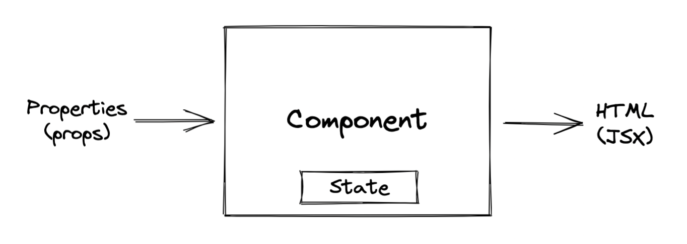
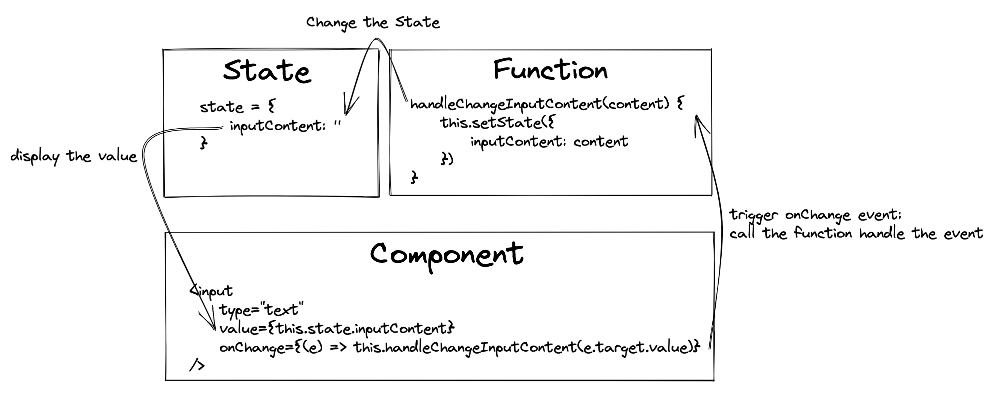
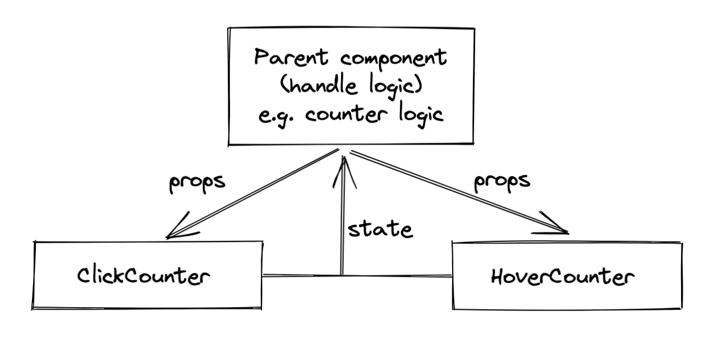
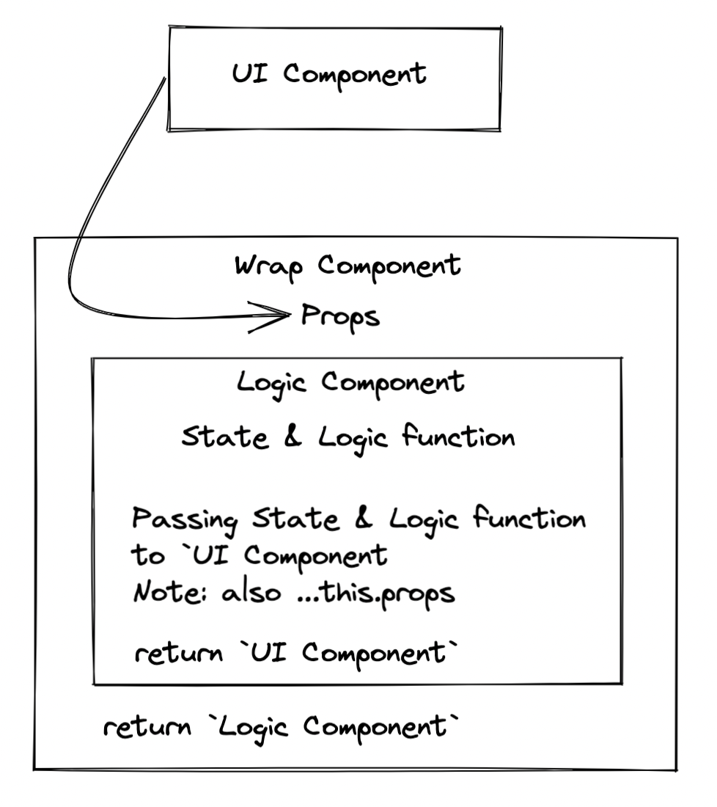
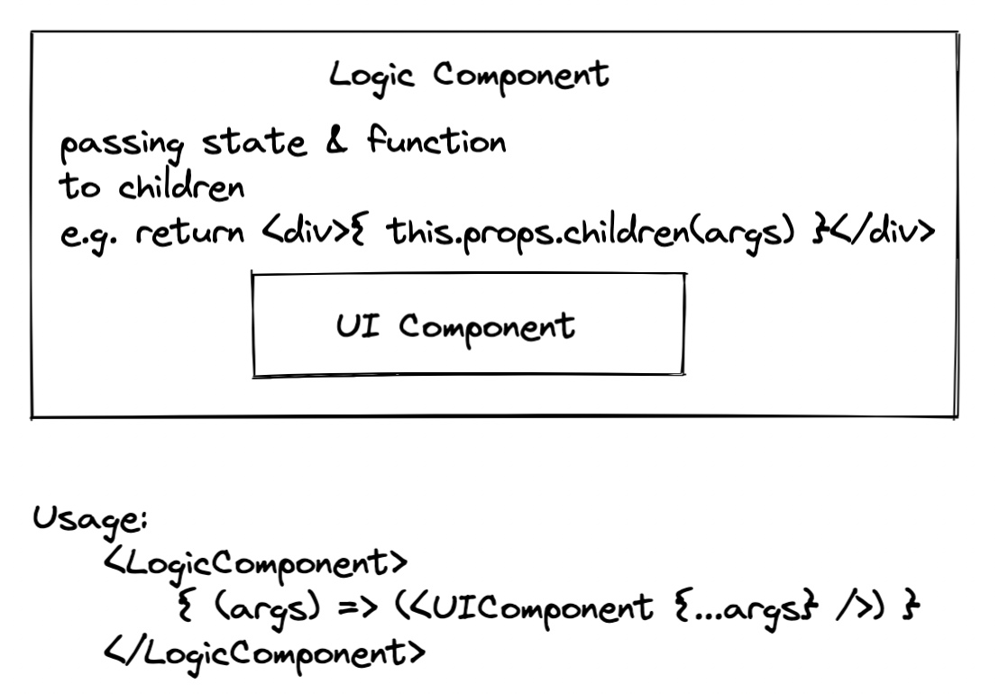

# React Foundation

[Default create-react-app README.md](./create-react-app-readme.md)

## Reference

- [ReactJS Tutorial for Beginners](https://youtu.be/QFaFIcGhPoM)

## creat-react-app

1. install `Node.js`
2. create react app via different approach

| Approach | Steps |
| --- | --- |
| npx | `$ npx create-react-app <project-name>` |
| npm | 1. `$ npm install create-react-app -g`<br/>2. `$ create-react-app <projct-name>` |

> Note: npx is a tool for executing Node packages
> 
> [Stack Overfloe: Difference between npx and npm?](https://stackoverflow.com/questions/50605219/difference-between-npx-and-npm#:~:text=NPX%20is%20an%20acronym%20for,without%20even%20installing%20that%20package.)


## Folder Structure

```
react-app
├── node_modules
├── package.json
├── package-lock.json
├── public
│   ├── favicon.ico
│   ├── index.html
│   └── manifest.json
└── src
    ├── index.js
    ├── ...
    └── ...
```

- package.json: Contain the dependencies and the script required for the project
- package-lock.json: Ensure consistent installation of the dependencies
- node_modules: The folder all the dependencies are installed
- public folder
    - manifest.json: Concerned with progressive web app
    - favicon.ico: Icon we see in the browser tab
    - index.html: The only html file we have in the application, it's mean we're building `single page applicatioin`
- src
    - index.js: the starting point of the application

## React Foundation - Component


- [What is jsx](./notes/what-is-jsx.md)
- What should we know about the component
    - handle `props`
    - create & update `state`
    - `methods as props`
        - [more props & state detail](./notes/props-vs-state.md)
    - `conditional rendering`
        - implementing conditional rendering
            - [source code - class component template(className="conditional-rendering-part")](./src/components/ClassComponent.js)
            - [source code - functional component template(className="conditional-rendering-part")](./src/components/FunctionalComponent.js)
    - `list rendering`
        - [about list rendering we should know](./notes/list-rendering.md)
    - `handle input`
        
    - `Lifecycle`
        - [lifecycle detail](./notes/lifecycle.md)
- Component template
    - [source code - class component template](./src/components/ClassComponent.js)
    - [source code - functional compoennt template](./src/components/FunctionalComponent.js)

## Styling in react
[see this vedio](https://youtu.be/j5P9FHiBVNo)

## Grouping children without adding extra nodes - Fragment
[Fragment detail](./notes/fragment.md)

## Improve Performance - PureComponent
- Pure Component(class component) & Memo Component(functional component)
    - React.PureComponent is similar to React.Component. The difference between them is that React.Component doesn’t implement `shouldComponentUpdate()`, but React.PureComponent implements it with a shallow prop and state comparison.
    - `React.memo -> react version ^16.6.0`
    - source code demo
        - [source code - Parent component](./src/pages/PureComponent.js)
        - [source code - Pure component](./src/components/PureComp.js)
        - [source code - Regular component](./src/components/RegComp.js)

## Access DOM node directly within react - Refs
- About Refs
    - class component: createRef()
        - way 1: use createRef()
        - way 2: use callback refs
- Demo: basic use
    - As the page loaded, by default, the input will be focused.
    - Fetch the input value by click the button.
    - [souce code - fous input while page loaded](./src/components/ref/FocusInputWhileLoaded.js)
- Demo: callback ref
    - Instead `createRef`, use callback ref.
    - NOTE: callback ref is the element itself.
    - [souce code - callback refs](./src/components/ref/CallbackRef.js)
- Demo: Access the refs with class component
    - parent: ref - `refChildComponent`
    - children: method - `focusInput()`
    - [souce code - parent component](./src/components/ref/RefWithClassComponent.js)
    - [source code - child component](./src/components/ref/RefWithClassComponent.js)
- Demo: React.forwardRef, passing ref to children component
    - child component: return React.forwardRef(component)
    - [source code - parent component](./src/components/ref/ForwardRef.js)
    - [source code - child component](./src/components/ref/ForwardRefChild.js)

## Render children into a DOM node that exists outside the DOM hierarchy of the parent component - ReactDOM.createPortal

- WHY use portal?
    - when the child component is a `modal`, a `pop-up`, or a `tool-tip`
- [reference - Portal](https://reactjs.org/docs/portals.html)
- [source code - demo on CodePen](https://codepen.io/gaearon/pen/jGBWpE)

## Share common functionality between components
- Higher Order Component
    - Lift business logic to parent component and pass props to children for display
    - Demo: Counter for `ClickCounter` and `HoverCounter`
    - [source code - wrapper component](./src/components/higher-order-component/Counter.js)
    - [source code - ui component](./src/components/higher-order-component/ClickCount.js)
    
    
    
- Render Props
    - The term `render prop` refers to a technique for `sharing code` between React components using `a prop whose value is a function`
    - Core: React can use a prop whose value is a function to control what is actual render by a component
    - [source code - logic component](./src/components/render-props/Counter.js)
    - [source code - ui component](./src/components/render-props/ClickCount.js)
    

## Context
Context provides a way to pass data through the component tree without having to pass props down manually at every level.

steps
1. Create the context
2. Provide a context value
3. Consume the context value

[more detail: context detail](./notes/context.md)

## HTTP and React

- http library: [axios](https://github.com/axios/axios)
- fake data from: [JSONPlaceholder](https://jsonplaceholder.typicode.com/)