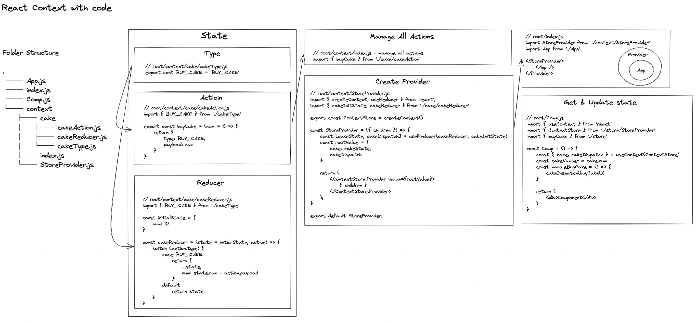

# React Context

[Reference: React Context & Hooks Tutorial](https://youtu.be/6RhOzQciVwI)

Context provides a way to pass data through the component tree without having to pass props down manually at every level.

## Basic Context

- [source code - ContextProvider](../src/components/context/basic/ContextProvider.js)
- [source code - Wrap Component](../src/pages/Context/BasicContext.js)
- [source code - Get Value](../src/components/context/basic/CompC.js)
- Callback Hell! -> solution: useContext Hook
1. Setting Provider
    ```javascript
    // ContextProvider.js
    import { createContext } from "react";

    export const Context = createContext()
    const ContextProvider = ({ children }) => {
        return (
            <Context.Provider value="some value">
                { children }
            </Context.Provider>
        );
    }
    
    export default ContextProvider;
    ```
    ```javascript
    // App.js
    import ContextProvider from 'path/to/ContextProvider.js'
    const App = () => {
        return (
            <ContextProvider>
                <AppChildrenComponent />
            </ContextProvider>
        )
    }
    ```
2. Get value in child component
    ```javascript
    // Any children component in App
    import { Context } from 'path/to/ContextProvider.js'

    const childComponent = () => {
        return (
            <div>
                <Context.Consumer>
                    {
                        value => {
                            return <div>{value}</div>
                        }
                    }
                </Context.Consumer>
            </div>
        )
    }
    ```
## useContext Hook
- [source code - Get Value](../src/components/context/basic/CompD.js)

useContext - Get value in child component

```javascript
// Any children component in App
import { useContext } from 'react'
import { Context } from 'path/to/ContextProvider.js'

const childComponent = () => {
    const value = useContext(Context)
    return (
        <div>
            { value }
        </div>
    )
}
```

## useReducer Hook
An alternative to `useState`

`useReducer` is usually preferable to `useState` when you have complex state logic that involves multiple sub-values or when the next state depends on the previous one.

### `reduce in js` VS `useReducer`

| | reduce | useReducer |
| --- | --- | --- |
| parameters | array.reduce(`reducerFunction`, initialValue) | useReducer(`reducerFunction`, initialState) |
| reducerFunction | singleValue = reducer(accumulator, currentValue) | newState = reducer(currentState, action) |
| return value | reduce method returns a `single value` | useReducer returns a pair of values. [`newState`, `dispatch`]

### `useState` VS `useReducer`
| scenario | useState | useReducer |
| --- | --- | --- |
| Type of state | Number, String, Boolean | Object or Array |
| Number of state transitions<br /><br />many states, like 5 or more, useReducer will make state transition predictable | One or Two | Too many | 
| Related state transitions?<br />e.g. isLoading, responseData, errorMsg | No | Yes |
| Business logic | No business logic | Complex business logic |
| Local vs global | Local | Global |


- [source code - useReducer](../src/pages/ContextAndReducer/BasicReducer.js)
```javascript
import { useReducer } from "react";

const initialState = {
    count: 0
}

const reducer = (state, action) => {
    switch (action.type) {
        case 'increment':
            return { ...state, count: state.count + action.payload }
        case 'decrement':
            return { ...state, count: state.count - action.payload }
        case 'reset':
            return initialState
        default:
            return state
    }
}

const BasicReducer = () => {
    const [state, dispatch] = useReducer(reducer, initialState)

    return (
        <div>
            <div>Count - { state.count }</div>
            <button onClick={() => dispatch({ type: 'increment', payload: 1})}>Increment</button>
            <button onClick={() => dispatch({ type: 'decrement', payload: 1})}>Decrement</button>
            <button onClick={() => dispatch({ type: 'reset'})}>Reset</button>
        </div>
    );
}
 
export default BasicReducer;
```

## Handle Global State with useContext and useReducer


- Build cake state
    - [source code - cake type](../src/components/contextAndReducer/handleGlobalState/context/cake/cakeType.js)
    - [source code - cake action](../src/components/contextAndReducer/handleGlobalState/context/cake/cakeAction.js)
    - [source code - cake reducer](../src/components/contextAndReducer/handleGlobalState/context/cake/cakeReducer.js)
- [source code - manage all actions](../src/components/contextAndReducer/handleGlobalState/context/index.js)
- [source code - Provider contains children component](../src/pages/ContextAndReducer/HandleGlobalState.js)
- [source code - Get & Update state](../src/components/contextAndReducer/handleGlobalState/children/CompC.js)
